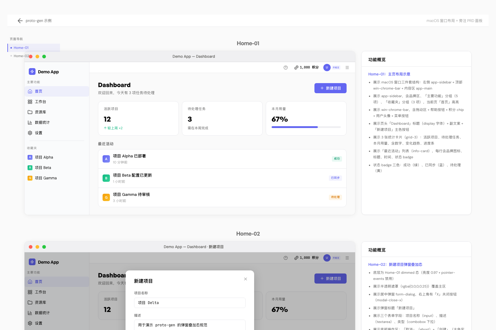

# proto-gen

> 给 Claude Code 用的 skill — 根据自然语言描述/PRD 快速生成高保真 HTML 原型。

适合在产品 MVP 阶段做方案演示与评审：把脑子里的构思一键变成可在浏览器打开的、带页面索引和功能旁注的可视化原型。**主题可插拔**（一份 tweakcn 链接换皮）+ **组件可视速查**（产品 / 测试 / AI 都能照着写需求）。



> 上图为 [`assets/example.html`](assets/example.html) 渲染效果，完整版（含弹窗叠加态）见 [`assets/screenshots/example-full.png`](assets/screenshots/example-full.png)。

## 这是什么

一套带[完整设计系统](assets/shared.css)的原型生成器。给一段需求描述（"做个任务管理页，列表 + 添加弹窗"），生成符合**三段结构契约**的 HTML：

- 左侧 **toc-sidebar**：全文件页面索引，sticky 卡片，滚动高亮
- 中间 **原型图**：1460×910 macOS 窗口外壳（左侧栏 + 顶部工具栏 + 内容区），多 section 垂直堆叠（主页 / 弹窗 / 抽屉 / 子页 ...）
- 右侧 **功能概览**：每个 section 一个 PRD 面板，与原型图**一一对应**
- **PRD ↔ 原型 双向高亮**：hover 任一 PRD bullet → 自动高亮对应原型组件（反向亦然），评审时跨视图对照零成本

四大基础设施：

| 资产 | 作用 |
|---|---|
| [`assets/theme.css`](assets/theme.css) | tweakcn 主题 token 单一来源（19 核心 + 8 sidebar + 12 状态色 + 字体 CDN）。默认 724-1 紫，**换主题改这一份** |
| [`assets/shared.css`](assets/shared.css) | 组件类骨架（按钮 / 卡片 / 弹窗 / sidebar / PRD 面板等）。颜色/字体/圆角全部 var() 引用 theme.css，主题切换自动跟随 |
| [`assets/components.html`](assets/components.html) | **人类可视组件库**：24 个通用组件含常态/hover/禁用/loading 四态横排 + Token 速查；写需求时直接说"展示主按钮（应用 .btn-primary 风格）"，不再描述具体颜色字号 |
| [`assets/prd-highlight.js`](assets/prd-highlight.js) | PRD ↔ 原型 双向 hover 联动运行时 |

> 当前覆盖 **PC · macOS 系列**；Mobile 系列规划中（外壳容器与对应 reference 后续独立扩展）。
> 高亮联动（`data-comp` / `data-target` / `prd-highlight.js`）是**评审脚手架**——交付研发实现真实业务代码时应整套丢弃，剥离清单见 [`references/prd-highlight.md`](references/prd-highlight.md) 的「交付给研发时」段。

## 安装

把这个仓库 clone 到 Claude Code 的 skills 目录：

```bash
git clone git@github.com:xieluoli/proto-gen.git ~/.claude/skills/proto-gen
```

Claude Code 启动时会自动加载所有 `~/.claude/skills/*` 下的 skill。

## 使用

在 Claude Code 里说：

> "做一个会员中心的原型，包含个人信息页、订单列表、订单详情"

或者：

> "帮我生成 MCP 管理页面的原型，要有列表 + 添加弹窗 + 详情抽屉"

触发关键词（在你的指令里包含其中一个就行）：生成原型、新建原型、写原型、画原型、做个原型、出个原型、新增一个 html、新建 html 原型。

第一次使用时，把**四件套**拷到你项目的原型目录下，生成的 HTML 通过相对路径引用：

```bash
mkdir -p your-project/prototypes
cp ~/.claude/skills/proto-gen/assets/theme.css         your-project/prototypes/
cp ~/.claude/skills/proto-gen/assets/shared.css        your-project/prototypes/
cp ~/.claude/skills/proto-gen/assets/components.html   your-project/prototypes/
cp ~/.claude/skills/proto-gen/assets/prd-highlight.js  your-project/prototypes/
```

原型 HTML 头部按顺序引入：

```html
<link rel="stylesheet" href="theme.css" />
<link rel="stylesheet" href="shared.css" />
<script src="prd-highlight.js" defer></script>
```

之后告诉 Claude "把生成的 HTML 放到 `your-project/prototypes/` 下" 即可。

## 换主题（业务定制）

默认主题是 **724-1**（tweakcn 紫调）。换其他主题只要给一个 tweakcn URL：

```bash
cd ~/.claude/skills/proto-gen/assets
./extract-theme.sh https://tweakcn.com/themes/<your-theme-id>
```

脚本会抽 tweakcn JSON 的 19 个 shadcn 核心 token 覆盖 `theme.css`，**本目录所有原型自动换皮**。sidebar 子 token + 状态色派生 tweakcn 不给（脚本会留 TODO 占位），切换主题后须按目标项目 `_app/index.css` 补齐——详见 [`references/default-theme.md`](references/default-theme.md) 切换流程 + [`references/shadcn-tweakcn-theme.md`](references/shadcn-tweakcn-theme.md) 接入陷阱。

## 查组件视觉规范

浏览器双击 [`assets/components.html`](assets/components.html)：

- 左侧 TOC 跳转
- 每个组件一行：组件名 / 类名（可点击复制）/ 常态 / hover / 禁用 / loading 四态横排 / 应用场景
- 末尾 **Token 速查**：theme.css 注入的所有 token 当前值（含色样）

写 PRD bullets 时**优先引用类名**替代具体值描述：

| ❌ 反例 | ✅ 正例 |
|---|---|
| 展示一个紫色 #6366F1 圆角 8px 主按钮 | 展示主按钮，应用 `.btn-primary` 风格 |
| 弹窗底部按钮间距 8px | 弹窗底部 `.form-actions`（右对齐两按钮） |

## 目录结构

```
proto-gen/
├── SKILL.md                              skill 入口（Claude Code 加载）
├── assets/
│   ├── theme.css                         主题 token 单一来源（默认 724-1，可换）
│   ├── shared.css                        组件类骨架（全部 var() 引用 theme.css）
│   ├── components.html                   人类可视组件库（24 个通用组件四态展示）
│   ├── extract-theme.sh                  tweakcn 主题切换脚本
│   ├── prd-highlight.js                  PRD ↔ 原型 双向 hover 联动
│   ├── example.html                      独立可运行示例
│   └── screenshots/                      example 渲染截图（README 用）
├── references/
│   ├── html-structure.md                 HTML 骨架 + modal/drawer/subpage 三态决策（PC·macOS）
│   ├── css-components.md                 类名 → 用途 → components.html 锚点 索引表 + 业务衍生类
│   ├── default-theme.md                  proto-gen 默认主题（724-1）+ 切换流程 + 圆角阶梯速查 + 装饰例外
│   ├── shadcn-tweakcn-theme.md           目标项目接入指引（sidebar 子 token 陷阱 / 字体大小映射 / lucide 踩坑）
│   ├── prd-rules.md                      PRD bullets 写法 + 重复引用规则 + 产品语言禁代码语言
│   └── prd-highlight.md                  data-comp / data-target 命名约定 + 交付剥离须知
└── evals/
    └── evals.json                        测试用例（可选）
```

## 设计系统速览

默认主题 [724-1](https://tweakcn.com/themes/cmpm3t0xk000104jq47h88i1g)（可换）：

| 维度 | 默认值 |
|---|---|
| 主色 | `oklch(0.5554 0.246 273)` 紫 |
| 字体 sans / mono | Google Sans Flex / IBM Plex Mono（CDN 自动加载） |
| 圆角 `--radius` | `1.3rem` (20.8px) → 阶梯 chip ≈ 5 / sm ≈ 17 / btn ≈ 19 / card ≈ 25 / full 9999 |
| 状态色 | success 绿 · warning 橙 · info=primary（按 shadcn 惯例） |
| macos-window 默认 | 1460×910（PC macOS 应用常见窗口大小） |

完整 token 表与切换方法见 [`references/default-theme.md`](references/default-theme.md)。组件清单可视速查见 [`assets/components.html`](assets/components.html)。

## 它解决了什么问题

**没有它时**：每次想用 HTML 原型沟通方案，要么写得太糙（vanilla style 没说服力），要么写得太精致（一个页面一两小时）。换业务还要重新调主题色字号圆角。

**有了它**：把"画 UI"这件事从手工变成 prompt——花在思考产品逻辑的时间，远多于在写 HTML 上。换业务只要换一份 tweakcn URL，整套原型一键变皮。组件视觉规范一份 HTML 速查，产品 / 测试 / AI 引用类名替代描述颜色字号。

## License

MIT
