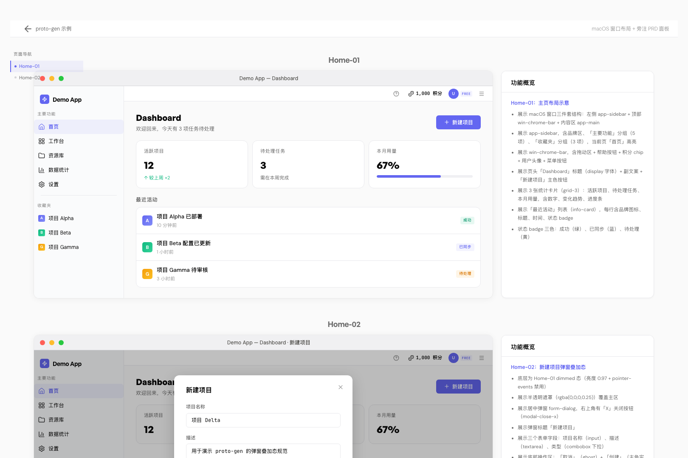

# proto-gen

> 给 Claude Code / Codex 用的 skill — 根据自然语言描述/PRD 快速生成高保真 HTML 原型。

适合在产品 MVP 阶段做方案演示与评审：把脑子里的构思一键变成可在浏览器打开的、带页面索引和功能旁注的可视化原型。**主题可插拔**（一份 tweakcn 链接换皮）+ **组件可视速查**（产品 / 测试 / AI 都能照着写需求）。



> 上图为 [`assets/example.html`](assets/example.html) 渲染效果，完整版（含弹窗叠加态）见 [`assets/screenshots/example-full.png`](assets/screenshots/example-full.png)。

## 这是什么

一套带[完整设计系统](assets/shared.css)的原型生成器。给一段需求描述（"做个任务管理页，列表 + 添加弹窗"），生成符合**三段结构契约**的 HTML：

- 左侧 **toc-sidebar**：全文件页面索引，sticky 卡片，滚动高亮
- 中间 **原型图**：1460×910 macOS 窗口外壳（左侧栏 + 顶部工具栏 + 内容区），多 section 垂直堆叠（主页 / 弹窗 / 抽屉 / 子页 ...）
- 右侧 **功能概览**：每个 section 一个 PRD 面板，与原型图**一一对应**
- **PRD ↔ 原型 双向高亮**：hover 任一 PRD bullet → 自动高亮对应原型组件（反向亦然），评审时跨视图对照零成本

四大基础设施：

| 资产 | 作用 |
|---|---|
| [`assets/theme.css`](assets/theme.css) | tweakcn 主题 token 单一来源（19 核心 + 8 sidebar + 12 状态色 + 字体 CDN）。默认 violet 紫，**换主题改这一份** |
| [`assets/shared.css`](assets/shared.css) | 组件类骨架（按钮 / 卡片 / 弹窗 / sidebar / PRD 面板等）。颜色/字体/圆角全部 var() 引用 theme.css，主题切换自动跟随 |
| [`assets/components.html`](assets/components.html) | **人类可视组件库**：24 个通用组件含常态/hover/禁用/loading 四态横排 + Token 速查；写需求时直接说"展示主按钮（应用 .btn-primary 风格）"，不再描述具体颜色字号 |
| [`assets/prd-highlight.js`](assets/prd-highlight.js) | PRD ↔ 原型 双向 hover 联动运行时 |

> 当前覆盖 **PC · macOS 系列**；Mobile 系列规划中（外壳容器与对应 reference 后续独立扩展）。
> 高亮联动（`data-comp` / `data-target` / `prd-highlight.js`）是**评审脚手架**——交付研发实现真实业务代码时应整套丢弃，剥离清单见 [`references/prd-highlight.md`](references/prd-highlight.md) 的「交付给研发时」段。

## 安装

Claude Code 和 Codex 读的是同一份 `SKILL.md`，装法只差目录。两边都**推荐装到项目里**——skill、评审规则、设计系统跟着仓库走，团队成员 clone 项目就有，不必各自配置。

### 装到 Claude Code

在你的**项目根目录**执行：

```bash
# 1. skill 本体
git clone git@github.com:xieluoli/proto-gen.git .claude/skills/proto-gen

# 2. 让评审 agent 生效（Claude Code 只识别 .claude/agents/ 下的 agent 定义，
#    skill 自带的那份在 .claude/skills/proto-gen/agents/，必须拷出来才会被加载）
mkdir -p .claude/agents
cp .claude/skills/proto-gen/agents/prototype-reviewer.md .claude/agents/
```

装完**重启会话**生效。验证：skill 列表里有 `proto-gen`，agent 列表里有 `prototype-reviewer`。

第 2 步不能省——skill 目录里的 `agents/` 不会被自动加载，不拷贝的话生成完原型无 agent 可用。

> **不需要**往项目里拷任何 css / js。生成的 HTML 是自包含单文件，样式由注入脚本回填（见下文「样式怎么进到 HTML 里」）。

### 装到 Codex

目录约定与 Claude Code 一致（`skills/<skill-name>/SKILL.md`），只是根目录换成 `.codex`。项目根执行：

```bash
git clone git@github.com:xieluoli/proto-gen.git .codex/skills/proto-gen
```

装完重启会话生效。**上面的第 2 步在 Codex 下不适用**——Codex 没有 `.claude/agents/` 这种"放一份 md 就注册成可调用 subagent"的目录。评审改成直接让它读规则文件执行，效果一样，只是少了独立上下文（见[评审](#评审)）。

下文「可选前置依赖」两项 Codex 都能装，命令见那张表。

### 四种装法的路径

<details>
<summary><b>多个项目共用一份？改装用户级</b></summary>

```bash
# Claude Code
git clone git@github.com:xieluoli/proto-gen.git ~/.claude/skills/proto-gen

# agent 可以跟着装用户级（所有项目通用），也可以只拷进某个项目
mkdir -p ~/.claude/agents
cp ~/.claude/skills/proto-gen/agents/prototype-reviewer.md ~/.claude/agents/

# Codex
git clone git@github.com:xieluoli/proto-gen.git ~/.codex/skills/proto-gen
```
</details>

| | Claude Code | Codex |
|---|---|---|
| **项目级**（推荐，跟仓库走） | `.claude/skills/proto-gen/` | `.codex/skills/proto-gen/` |
| **用户级**（多项目共用） | `~/.claude/skills/proto-gen/` | `~/.codex/skills/proto-gen/` |

**本文档里的命令路径一律按 Claude Code 项目级写**，用其他装法就换掉前缀。

项目级与用户级可以并存，就近优先：项目级那份会覆盖用户级的同名 skill。想给某个项目定制主题或评审规则，就用项目级。

### 可选前置依赖

不装也能用，装了链条更完整：

| 依赖 | 补什么 | 装法 |
|---|---|---|
| [OpenSpec](https://github.com/Fission-AI/OpenSpec) | 需求文档骨架，让原型挂在一份变更提案下，改了什么、为什么改可追溯 | `npm i -g @fission-ai/openspec` → 项目根跑 `openspec init` |
| [superpowers](https://github.com/obra/superpowers) | brainstorming / writing-plans / verification 等流程 skill，补上「想清楚」与「验收」两端 | Claude Code：`/plugin install superpowers@claude-plugins-official`<br>Codex：`codex plugin add superpowers@openai-curated` |

装了 OpenSpec 后，原型建议放在 `openspec/changes/<change-name>/prototypes/`，与该变更的 proposal.md / spec.md 同级。

## 还没有设计系统？直接开工

**这是绝大多数人第一次用它时的情况，不影响出图。** proto-gen 自带一整套可用的设计系统（默认 violet 紫主题 + 24 个组件），装完就能生成原型，不需要你先有品牌色、色板或组件库。

主题是**可插拔**的：`theme.css` 是唯一的 token 源，`shared.css` 里所有颜色 / 字体 / 圆角都 `var()` 引用它。所以路径是这样的——

| 你的处境 | 怎么走 |
|---|---|
| **完全没有设计系统** | 什么都不用做，用默认主题开工。等品牌定下来再换，**已经画好的原型会自动跟着变** |
| **有品牌色，但没成体系** | 去 [tweakcn](https://tweakcn.com) 挑一个接近的主题（或在线调色导出），把 URL 交给下面的换肤脚本 |
| **已有产品代码**（用过 `shadcn init`） | 从项目 `src/index.css` / `app/globals.css` 抽 token 覆盖 `theme.css`，见 [`references/shadcn-tweakcn-theme.md`](references/shadcn-tweakcn-theme.md) |

先出图沟通产品逻辑，比先纠结色号要紧得多——换皮的操作见下文[「换主题」](#换主题业务定制)，两条命令。

## 使用

在 Claude Code / Codex 里说：

> "做一个会员中心的原型，包含个人信息页、订单列表、订单详情"

或者：

> "帮我生成 MCP 管理页面的原型，要有列表 + 添加弹窗 + 详情抽屉"

触发关键词（在你的指令里包含其中一个就行）：生成原型、新建原型、写原型、画原型、做个原型、出个原型、新增一个 html、新建 html 原型。

再告诉 Claude 放哪，比如 "放到 `your-project/prototypes/` 下"。

### 样式怎么进到 HTML 里

原型要**自包含**（研发和评审拿到单文件双击就能开），但 token 和通用组件样式**只维护一份**——在本 skill 的 `assets/` 下。两者靠注入脚本连接：生成的 HTML 头部带一组 `@proto-gen` 标记注释，脚本把 `theme.css` / `shared.css` / `prd-highlight.js` 的最新内容填进标记之间。

```bash
# 单文件或整个目录（递归收集 *.html）都行，幂等，可反复跑
.claude/skills/proto-gen/assets/inject-assets.mjs your-project/prototypes/
```

改完主题或组件样式，跑一次这条命令，**所有原型统一换皮**。页面自有样式写在标记块之外，注入不会碰。

## 评审

原型生成或大改后，跑一次评审拿批量问题清单，一次性修完再交付。

评审 agent 在[安装](#安装)第 2 步已经拷到 `.claude/agents/`，直接在 Claude Code 里说 "用 prototype-reviewer 审查 xxx.html" 即可。

Codex 没有等价的 agent 注册目录，改成说 "按 `.codex/skills/proto-gen/references/review-checklist.md` 审查 xxx.html，只读不改文件"——规则同源，产出一致，区别只是评审跑在当前上下文里而非独立上下文。

评审只读、不改文件，产出分段问题清单：

- **组件复用** —— 有没有自造已存在的类名、有没有重复 3 次该抽母版的片段
- **基于最新原型迭代** —— 有没有从旧版本起步、通用区域是否与最近一份产出对齐
- **结构契约 / PRD 面板 / 脚手架剥离**
- **风格沉淀建议** —— 本轮值得固化的组件模式、尚未沉淀的重复写法、项目规范里已过期的条目

最后一段是给人看的：**确认后再落笔**写进设计文档，评审本身不动任何文件。完整规则见 [`references/review-checklist.md`](references/review-checklist.md)；项目有自己的主题 token / 外壳结构约定，就在项目那份 agent 文件里叠加特化规则。

## 换主题（业务定制）

默认主题是 **violet**（tweakcn 紫调）。换其他主题只要给一个 tweakcn URL，两条命令：

```bash
# 1. 换 token（抽 tweakcn JSON 的 19 个 shadcn 核心 token 覆盖 theme.css）
.claude/skills/proto-gen/assets/extract-theme.sh https://tweakcn.com/themes/<your-theme-id>

# 2. 刷进已有原型（不跑这步，已生成的自包含 HTML 不会变）
.claude/skills/proto-gen/assets/inject-assets.mjs your-project/prototypes/
```

⚠️ tweakcn 只给 19 个核心 token，下面 **3 项它不给**，脚本会留 TODO 占位，**必须补**，否则有可见问题：

| 要补的 | 不补的后果 |
|---|---|
| sidebar 子 token（8 个） | 侧边栏激活态背景 / 文字色错 |
| 状态色派生（success / warning / info 各 4 个） | badge、提示条没颜色 |
| 字体确认 | 非 Google Fonts 来源需手工改 `theme.css` 头部 `@import` |

补法详见 [`references/default-theme.md`](references/default-theme.md)（切换流程）+ [`references/shadcn-tweakcn-theme.md`](references/shadcn-tweakcn-theme.md)（接入陷阱）。

## 查组件视觉规范

浏览器双击 [`assets/components.html`](assets/components.html)：

- 左侧 TOC 跳转
- 每个组件一行：组件名 / 类名（可点击复制）/ 常态 / hover / 禁用 / loading 四态横排 / 应用场景
- 末尾 **Token 速查**：theme.css 注入的所有 token 当前值（含色样）

写 PRD bullets 时**优先引用类名**替代具体值描述：

| ❌ 反例 | ✅ 正例 |
|---|---|
| 展示一个紫色 #6366F1 圆角 8px 主按钮 | 展示主按钮，应用 `.btn-primary` 风格 |
| 弹窗底部按钮间距 8px | 弹窗底部 `.form-actions`（右对齐两按钮） |

## 目录结构

```
proto-gen/
├── SKILL.md                              skill 入口（Claude Code / Codex 均加载）
├── agents/
│   └── prototype-reviewer.md             原型评审 subagent（Claude Code 专有，拷到项目 .claude/agents/ 使用）
├── assets/
│   ├── theme.css                         主题 token 单一来源（默认 violet，可换）
│   ├── shared.css                        组件类骨架（全部 var() 引用 theme.css）
│   ├── components.html                   人类可视组件库（24 个通用组件四态展示）
│   ├── extract-theme.sh                  tweakcn 主题切换脚本
│   ├── inject-assets.mjs                 样式注入脚本（assets 单一源 → 自包含 HTML）
│   ├── prd-highlight.js                  PRD ↔ 原型 双向 hover 联动
│   ├── example.html                      独立可运行示例
│   └── screenshots/                      example 渲染截图（README 用）
├── references/
│   ├── html-structure.md                 HTML 骨架 + modal/drawer/subpage 三态决策（PC·macOS）
│   ├── css-components.md                 类名 → 用途 → components.html 锚点 索引表 + 业务衍生类
│   ├── default-theme.md                  默认主题（violet）+ 切换流程 + 圆角阶梯与装饰例外（圆角规范单一源）
│   ├── shadcn-tweakcn-theme.md           对齐外部项目主题：sidebar 子 token 陷阱 / 状态色真值 / tailwind 映射 / lucide 踩坑
│   ├── prd-rules.md                      每条 bullet 怎么写：元素模板 + 重复引用 + 产品语言禁代码语言
│   ├── prd-document.md                   整篇 PRD 文档怎么组织：章节骨架 + 框架树 + 配置表 + 命名约定
│   ├── prd-highlight.md                  data-comp / data-target 命名约定 + 交付剥离须知
│   └── review-checklist.md               评审清单（组件复用 / 基于最新迭代 / 风格沉淀），prototype-reviewer 的规则源
```

## 设计系统速览

默认主题 [violet](https://tweakcn.com/themes/cmpm3t0xk000104jq47h88i1g)（可换）：

| 维度 | 默认值 |
|---|---|
| 主色 | `oklch(0.5554 0.246 273)` 紫 |
| 字体 sans / mono | Google Sans Flex / IBM Plex Mono（CDN 自动加载） |
| 圆角 `--radius` | `1.3rem` (20.8px) → 阶梯 chip ≈ 5 / sm ≈ 17 / btn ≈ 19 / card ≈ 25 / full 9999 |
| 状态色 | success 绿 · warning 橙 · info=primary（按 shadcn 惯例） |
| macos-window 默认 | 1460×910（PC macOS 应用常见窗口大小） |

完整 token 表与切换方法见 [`references/default-theme.md`](references/default-theme.md)。组件清单可视速查见 [`assets/components.html`](assets/components.html)。

## 它解决了什么问题

**没有它时**：每次想用 HTML 原型沟通方案，要么写得太糙（vanilla style 没说服力），要么写得太精致（一个页面一两小时）。换业务还要重新调主题色字号圆角。

**有了它**：把"画 UI"这件事从手工变成 prompt——花在思考产品逻辑的时间，远多于在写 HTML 上。换业务只要换一份 tweakcn URL，整套原型一键变皮。组件视觉规范一份 HTML 速查，产品 / 测试 / AI 引用类名替代描述颜色字号。

## License

MIT
